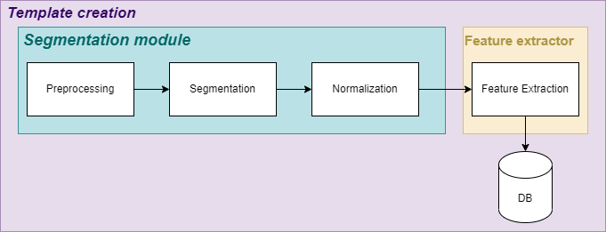

# Iris-Recognition
This project concerns the creation of a complete biometric system, based entirely on the use of iris images (in visible wavelength). 

The project is mainly structured in **two modules**:
- **Segmentation**: the *"ISis v.2"* method and the *"Hough approach"* method are proposed (code visible in "`SegmentationModule`" directory).
- **Feature extraction**: several models based on CNNs are proposed, finetuned and trained using a *few-shot learning* approach, through *siamese networks* (code visible in "`Notebook`" directory).



This project also includes the implementation of a **"demo"** of the proposed system based on a subset of the proposed models, namely *"Hough approach"* for segmentation and *"featNet"* trained from scratch for feature extraction (code visible in "`Demo`" directory).

## Important note
In each directory there is a more specific `README.md` file, containing detailed information on how to use that specific code (e.g. in `Segmentation` directory is explained how to compile the code and how it's structured)

<!-- ## How to install
I reccomend using CMake-GUI because it's easier, anyway you must have [OpenCV](https://opencv.org/) installed on your machine.
Then just:
```bash
git clone https://github.com/edu-rinaldi/Iris-Recognition && cd Iris-Recognition
mkdir build && cd build
cmake ..
cmake --build .
```

Or if you want to use Xcode, VS or other generator:

```bash
git clone https://github.com/edu-rinaldi/Iris-Recognition && cd Iris-Recognition
mkdir build && cd build
cmake -G [generator_name] ..
``` -->
